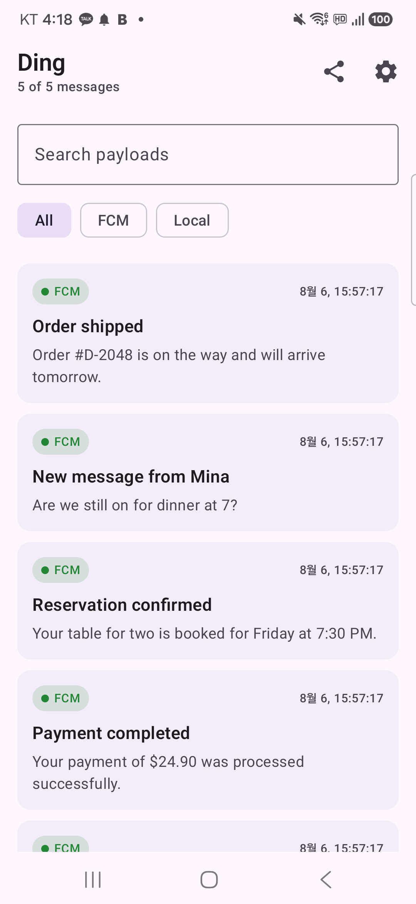
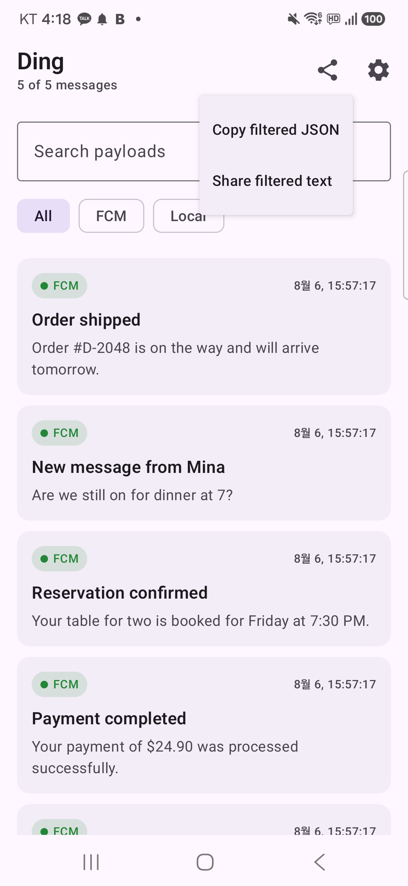
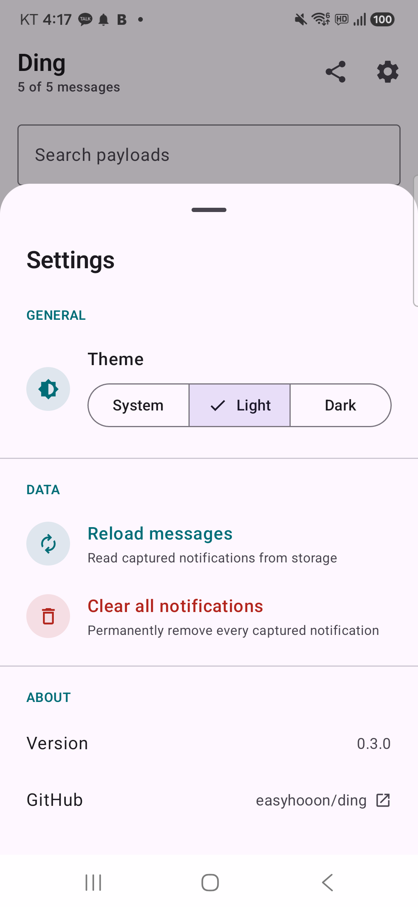
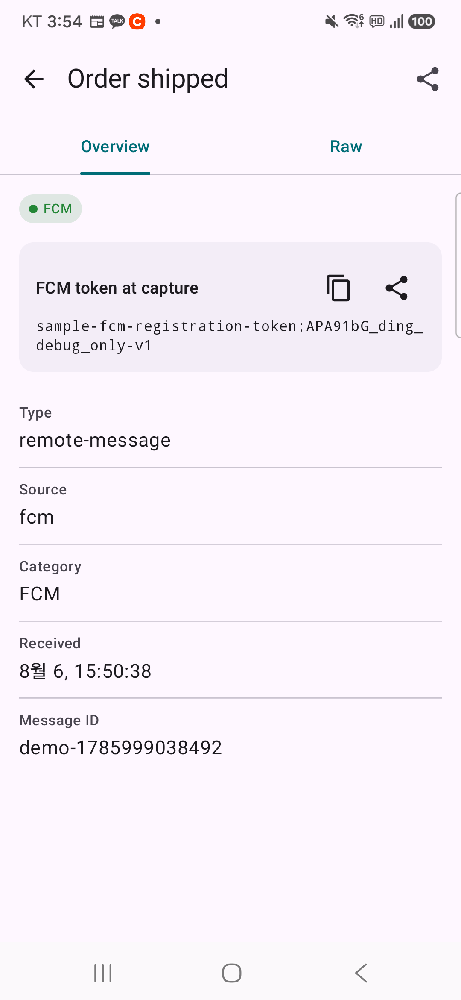
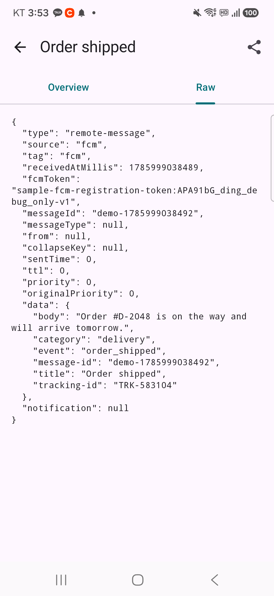
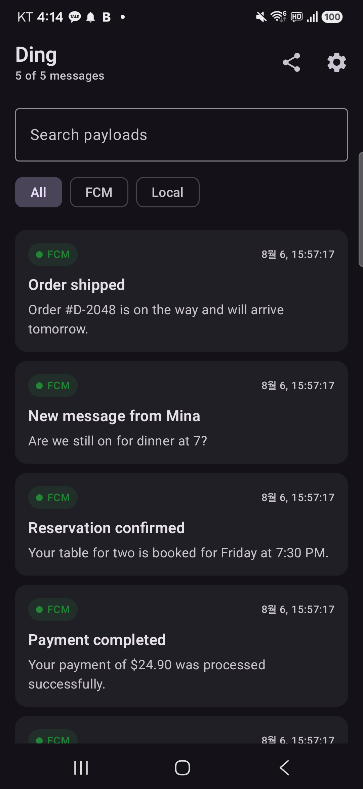

# Ding

Android notification payload inspector for debug builds.

> `Ding` takes its name from the short sound of a notification arriving—a small cue that something happened and is ready to inspect.

Ding captures notification-related payload snapshots from real apps and provides a debug UI for inspecting them.

See notification history at a glance, then drill into capture metadata and raw payloads when something looks wrong.

## Screenshots

<table>
  <tr>
    <td align="center"><b>Message List</b></td>
    <td align="center"><b>Filtered Actions</b></td>
    <td align="center"><b>Settings</b></td>
  </tr>
  <tr>
    <td></td>
    <td></td>
    <td></td>
  </tr>
  <tr>
    <td align="center"><b>Overview</b></td>
    <td align="center"><b>Raw JSON</b></td>
    <td align="center"><b>Dark Mode</b></td>
  </tr>
  <tr>
    <td></td>
    <td></td>
    <td></td>
  </tr>
</table>

## Current Status

The published Maven artifacts share version `0.4.0`.

Kotlin Multiplatform support is being added incrementally. The shared `ding-core` module normalizes Android payloads and Apple `userInfo` and provides an Apple capture façade with process-local or Room-backed storage. The existing Android coordinates and `Ding.capture(...)` API remain unchanged. Native Apple distribution uses a static XCFramework through Swift Package Manager starting with `0.5.0`. See [the KMP/iOS research note](docs/research/kmp-ios-push-support.md).

Initial supported capture paths:

- Firebase `RemoteMessage`
- app-created local notifications

Ding UI:

- dynamic `Open Ding` shortcut with a bell icon on the host app
- persistent debug notification that opens the inspector when tapped
- compact newest-first Compose message list
- FCM / Local source filters and payload search
- source/category badges
- Overview / Raw detail tabs
- per-message FCM registration token display, copy, and share actions
- top-bar copy and share menus for individual messages and filtered results
- settings sheet with persistent System / Light / Dark theme selection
- reload, clear-all, library version, and GitHub actions in settings

## Distribution Channels

Choose the channel that matches where Ding is called:

| Consumer | Channel | Package |
| --- | --- | --- |
| Android app with the debug inspector UI | Maven Central | `ding` and `ding-noop` |
| Shared Kotlin in a KMP project | Maven Central | `ding-core` |
| Native iOS app calling Ding from Swift | Swift Package Manager | `Ding` XCFramework product, starting with `0.5.0` |

These are alternative integration paths, not three required dependencies. A KMP app that calls `ding-core` from shared Kotlin does not also need the Swift package. Add SwiftPM only when native Swift code imports `Ding` directly.

## Installation

### Android

```kotlin
dependencies {
    debugImplementation("io.github.easyhooon:ding:0.4.0")
    releaseImplementation("io.github.easyhooon:ding-noop:0.4.0")
}
```

`ding` resolves `ding-core` transitively. Android applications should not add the core artifact or its platform variants separately.

### Kotlin Multiplatform

Add the shared core only when capturing and processing notification snapshots from KMP source sets:

```kotlin
kotlin {
    sourceSets {
        commonMain.dependencies {
            implementation("io.github.easyhooon:ding-core:0.4.0")
        }
    }
}
```

Gradle selects the Android or Apple platform variant automatically. Do not declare artifacts such as `ding-core-android` or `ding-core-iosarm64` directly. A KMP application's Android app module can still use the `ding` / `ding-noop` configuration above to include the inspector UI only in debug builds.

### Swift Package Manager

Native Apple hosts that call Ding directly from Swift can select **File > Add Package Dependencies** in Xcode and enter:

```text
https://github.com/easyhooon/ding
```

Or declare it in `Package.swift` starting with the first remote SwiftPM release, `0.5.0`:

```swift
dependencies: [
    .package(
        url: "https://github.com/easyhooon/ding.git",
        from: "0.5.0"
    ),
]
```

Add the `Ding` product to the iOS target, then `import Ding` from the notification callback that forwards the original APNs `userInfo`. SwiftPM downloads the versioned `Ding.xcframework.zip` from the matching GitHub Release and verifies it against the checksum in `Package.swift`.

Version `0.1.0` was published under the retired `notification-inspector` coordinates. Ding `0.2.0` moves to new Maven coordinates, the `io.github.easyhooon.ding` Kotlin package, and the `Ding` public API before external adoption.

## Usage

```kotlin
override fun onMessageReceived(remoteMessage: RemoteMessage) {
    Ding.capture(this, remoteMessage)
}
```

`RemoteMessage` does not expose the registration token targeted by the sender. Keep Ding's latest-token cache synchronized from `FirebaseMessagingService.onNewToken`:

```kotlin
override fun onNewToken(token: String) {
    Ding.updateFcmToken(this, token)
}
```

Also refresh the cache from `FirebaseMessaging.getToken()` at app startup so a restored process does not depend on receiving a new callback:

```kotlin
FirebaseMessaging.getInstance().token.addOnSuccessListener { token ->
    Ding.updateFcmToken(applicationContext, token)
}
```

The token is persisted by the debug implementation; subsequent two-argument `capture()` calls automatically attach the latest value to each new snapshot. Historical snapshots keep their original token when it changes.

If the host already has the token at capture time, the explicit overload records it and also refreshes the latest-token cache:

```kotlin
Ding.capture(
    context = this,
    remoteMessage = remoteMessage,
    fcmToken = latestFcmToken,
)
```

Messages captured before a token is registered show `Not captured` in the FCM token section. The stored value is host-supplied context, not proof that the sender targeted that token; topic and condition messages may not target one registration token directly.

```kotlin
Ding.captureNotification(
    context = context,
    source = "notification-test",
    notificationId = notificationId,
    title = title,
    body = body,
    data = mapOf("thread-id" to threadId),
)
```

The debug implementation initializes automatically when the host app starts. Long-press the host app icon and select `Open Ding`, or tap the persistent Ding notification, to open the captured payload list. The library does not add a separate launcher icon.

The persistent notification is enabled by default. It only shows the captured count and latest category. Disable it when the notification entry point is not wanted:

```kotlin
Ding.setPersistentNotificationEnabled(context, enabled = false)
```

Call the same API with `enabled = true` to restore it. The explicit choice persists across process restarts. On Android 13 and newer, the host app remains responsible for requesting `POST_NOTIFICATIONS` at an appropriate time.

### KMP Apple capture preview

`ding-core` provides a host-owned capture façade for forwarding the original APNs `userInfo` without installing or replacing notification delegates. Create the persistent store from the Apple source set (`iosMain`):

```kotlin
val store = PersistentDingCaptureStore.get(
    storagePath = dingStoragePath,
)
val ding = DingAppleCapture(store)

ding.updateFcmToken(latestFcmToken)
ding.captureAppleUserInfo(
    userInfo = userInfo,
    transport = PushTransport.FCM_APNS,
    capturePoint = CapturePoint.FOREGROUND,
)
```

FCM and APNs tokens are stored separately, and every snapshot retains the token that was current when it was captured. The host must supply one stable, app-private path ending in `.db`; the Room-backed store keeps the newest 50 snapshots by default. Reuse the returned store for that path.

`InMemoryDingCaptureStore` remains available when process-local history is sufficient. The persistent store currently targets callbacks in the main app process. Notification Service Extension/App Group sharing remains a separate follow-up step.

SwiftPM packaging can be verified locally on macOS:

```bash
./gradlew :ding-core:packageDingSwiftPM
./gradlew :ding-core:verifyDingLocalSwiftPackage
```

The first task writes `Ding.xcframework.zip` and its SwiftPM checksum under `ding-core/build/swiftpm/release`. The second resolves the local binary target and type-checks Ding's exported API with the Swift compiler. Tagged releases publish that exact archive as a GitHub Release asset and include a root manifest with the matching checksum.

## Strategy

See [docs/WORK_STRATEGY.md](docs/WORK_STRATEGY.md).

## Sample

Run the `sample` module and tap:

- `Send Local Notification`
- `Add Demo FCM Notifications`
- `Rotate Sample FCM Token`
- `Enable Ding notification`
- `Disable Ding notification`
- `Open Ding`

The captured local notification appears under the `Local` filter. The demo FCM action adds realistic delivery, message, reservation, payment, and activity notifications under `FCM`.

## Privacy

Notification payloads can contain personal data, authentication material, or internal identifiers. FCM registration tokens identify app instances and are included in raw JSON and exports when captured. Keep Ding on debug builds, review copied or exported content before sharing it, and never attach raw production payloads or tokens to public issues.

## License

Ding is licensed under the [Apache License 2.0](LICENSE).
